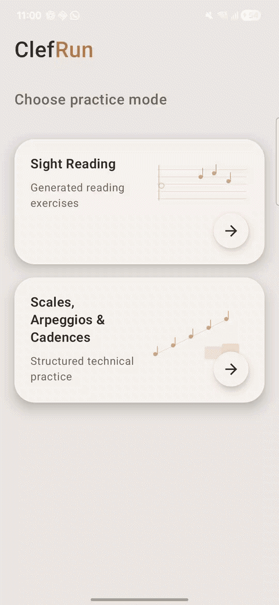

# ClefRun


**ClefRun** is an experimental Android app for piano sight-reading and targeted practice generation.

The goal is to move beyond generic random-note sight-reading drills. ClefRun explores a hybrid approach where a learner can describe what they want to practise, the app creates an `ExercisePlan`, and a deterministic generator turns that plan into a MusicXML score with a short coach cue.

Example:

> “I struggle with accidentals.”

ClefRun can turn that into:

- a focused exercise plan,
- generated sheet music,
- a short coach tip,
- and eventually a progression of targeted practice tasks.

> Status: experimental / work in progress. The app is currently focused on validating the exercise-generation pipeline before polishing the full learning experience.

---

## Demo



ClefRun currently supports a local-first workflow with optional remote AI planning. The app remains usable without the backend.

---

## Why this exists

Most sight-reading tools generate generic material. That can be useful, but it often does not answer the real practice question:

> “What exactly am I weak at, and can I practise that directly?”

ClefRun is built around targeted practice:

```text
targeted practice input
        ↓
ExercisePlanProvider
        ↓
ExercisePlan
focus + constraints + coach
        ↓
deterministic generator
        ↓
MusicXML
        ↓
OSMD/WebView renderer
```

The important idea is that AI should not freely generate arbitrary notation. Instead, AI can help interpret the user’s intent, while deterministic code keeps the generated exercise valid, playable, and testable.

---

## Current features

- Sight-reading exercise generation
- MusicXML rendering through OpenSheetMusicDisplay in a WebView
- Targeted practice input
- Local deterministic exercise planning
- Optional remote exercise planning backend
- Local fallback when the backend is unavailable
- Short coach tips tied to the selected exercise focus
- Technical-practice experiments such as scales and cadences
- Jetpack Compose UI
- ViewModel + StateFlow state management
- Hilt dependency injection
- Retrofit + OkHttp remote API integration

---

## Architecture

ClefRun is structured around a small domain/data/feature/UI split.

The architecture is intentionally evolving with the app. I am not trying to force a large Clean Architecture setup or add abstractions before they are useful. The current split exists to keep the growing pieces understandable: UI, exercise planning, remote data, dependency wiring, and platform-independent generation code.

The repository also contains a `core` module for platform-independent generation/domain code. It is currently used by Android, but it is kept separate so parts of the exercise generation pipeline could later be reused from another client, such as iOS or Compose Multiplatform.

```text
app/src/main/java/com/clefrun/app/
  data/
    exerciseplan/
      remote/        # Retrofit API, remote DTOs, remote provider, remote mapper

  domain/
    exerciseplan/    # ExercisePlan, constraints, providers, local/fallback planning

  feature/
    sightreading/    # Sight Reading ViewModel, route, screen, options sheet

  ui/
    coach/           # Coach bubble and coach tip UI
    score/           # Score rendering UI
    theme/           # Compose theme

  di/                # Hilt modules for networking and exercise-plan wiring
  navigation/        # App navigation
```

The current flow is:

```text
targeted practice text
        ↓
ExercisePlanProvider
   ├─ LocalExercisePlanProvider
   └─ RemoteExercisePlanProvider
        ↓
ExercisePlan
focus + constraints + coach
        ↓
Rule-based generator
        ↓
MusicXML
        ↓
OSMD/WebView renderer
```

The Android app stays local-first. Remote planning is optional and falls back to local planning when disabled or unavailable.

---

## ExercisePlan concept

ClefRun uses an `ExercisePlan` as the bridge between user intent, AI/local planning, and deterministic generation.

A simplified remote response looks like this:

```json
{
  "focus": "ACCIDENTALS",
  "constraints": {
    "accidentalDensity": "MEDIUM",
    "rightHandMotion": "MOSTLY_STEPWISE",
    "leftHandTexture": "SIMPLE_BASS",
    "maxLeap": "THIRD"
  },
  "coach": {
    "title": "Sharps and flats",
    "body": "Scan the altered notes before playing and keep the pulse steady.",
    "watchOut": "Do not let an accidental interrupt the count."
  }
}
```

The Android app maps this response into its internal `ExercisePlan` model. The generator can then use the plan to produce a MusicXML score.

---

## Local vs remote planning

ClefRun supports two planning paths:

```text
LocalExercisePlanProvider
  deterministic keyword/focus mapping
  works offline
  always available

RemoteExercisePlanProvider
  calls ClefRun backend
  may use AI server-side
  falls back to local provider on failure
```

The app is designed to remain functional even when the backend is disabled or unavailable.

The Android app never calls Gemini/OpenAI directly. API keys and prompt strategy belong on the backend side only.

---

## Security notes

- No AI API keys are stored in the Android app.
- The Android app only calls the ClefRun backend.
- Prompt strategy is kept server-side.
- Remote failures fall back to local generation.
- Local HTTP is intended for debug/testing only.

---

## Roadmap

Longer-term ideas:

- Practice history
- Backend deployment
- PostgreSQL-backed generation logs
- User progression model
- Teacher-facing worksheet generation
- Generator library/API for targeted music practice

---

## Project direction

ClefRun is not intended to be just an “LLM generates sheet music” experiment.

The long-term goal is a controllable music-practice generation engine:

```text
learner weakness
    ↓
pedagogical plan
    ↓
validated constraints
    ↓
deterministic generator
    ↓
playable exercise
    ↓
practice feedback / progression
```

The current app is the first client for that engine.

You may use, modify, and distribute this project under the terms of the AGPLv3. If you modify the software and make it available over a network, you must make the corresponding source code available under the same license.

See [LICENSE](LICENSE) for details.